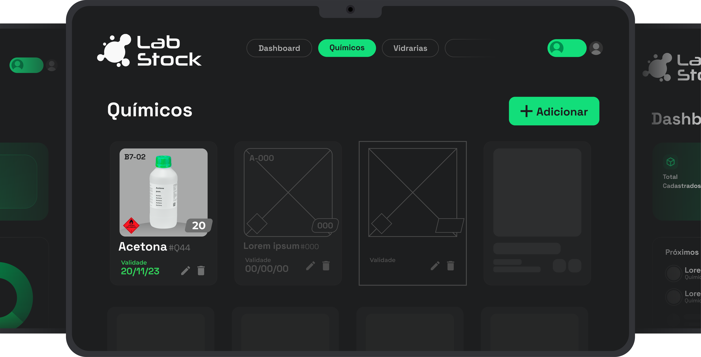
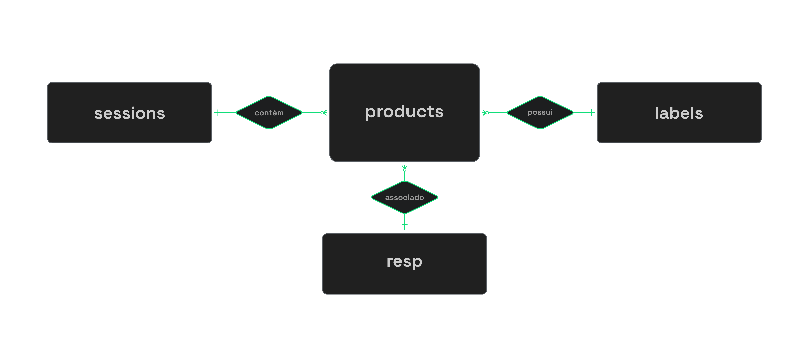
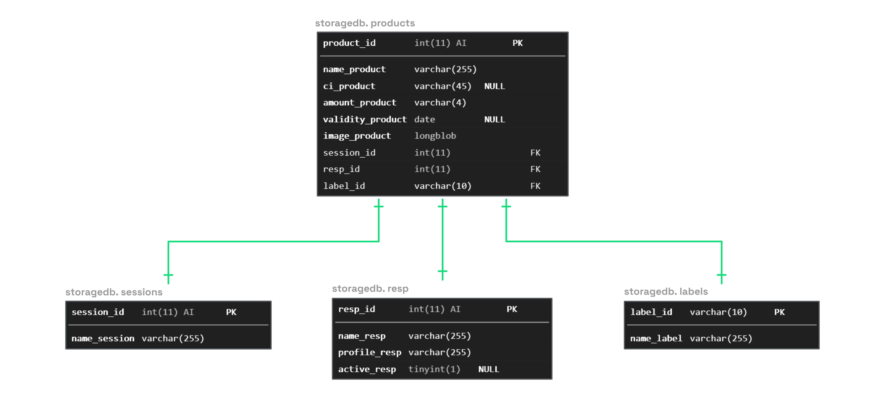

 <div align="center">
  
</div>

## Lab Stock - Sistema de Gerenciamento de Inventário de Laboratório Químico
> O **Lab Stock** é uma aplicação básica desenvolvida para otimizar o gerenciamento de inventário em laboratórios químicos. Através de uma interface intuitiva, oferece recursos robustos para controlar produtos químicos, vidrarias e equipamentos, proporcionando uma visão clara e organizada do estoque laboratorial.

<div align="center">
  
</div>

## Visão Geral

### 1.1 Objetivo

Visa simplificar e aprimorar o controle de inventário em laboratórios químicos, fornecendo uma solução eficiente para o acompanhamento de produtos, vidrarias e equipamentos.

### 1.2 Recursos

* [x] **Dashboard Visual**: Apresenta gráficos e métricas importantes para uma visão rápida do estoque.
* [x] **Validade mais próxima**: Controle de Validade de Produtos.
* [x] **Gerenciamento de Produtos**: Permite cadastrar, editar e remover produtos com facilidade.
* [x] **Alternância de Usuário**: Possibilita a troca rápida entre responsáveis ativos no laboratório.
* [x] **Relatório de Inventário**: Fornecimento em documento, das informações sobre os itens presentes no estoque, auxiliando na gestão adequada.

### 1.3 DFD
<div align="center">
  
</div>
<div align="center">
  
</div>

## Instalação

### 2.1 Requisitos do Sistema

- Servidor web (por exemplo, Apache)
- PHP (7.0 ou superior)
- MySQL
- Navegador web moderno

### 2.2 Configuração do Ambiente

1. Clone o projeto localmente
```bash
git clone https://github.com/BREN0sx/inventory-manager && cd inventory-manager
```
2. Configure um servidor web
3. Importe o [arquivo sql](labStock.sql) no MySQL

## Notas Adicionais

Este projeto é uma simulação para fins educacionais e práticos. Qualquer semelhança com sistemas reais é coincidência. Este projeto não se destina a fins comerciais.

---

**Lab Stock** - Gerencie seu inventário laboratorial de maneira eficiente e organizada.

<div align="center">
  
</div>
